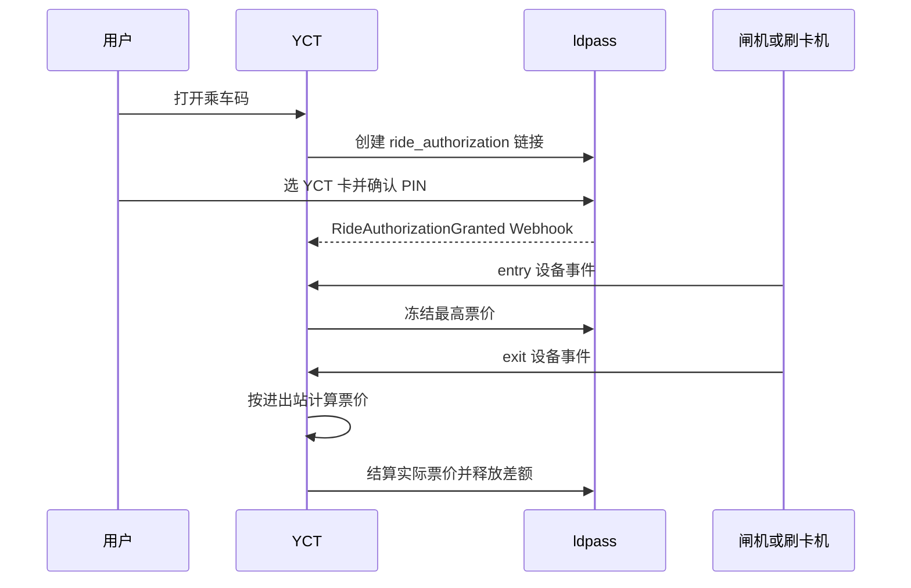

# 乘车码预授权与设备网关

本实现以一次乘车会话为边界，而不是以单个 ldpass 操作链接为边界。用户打开乘车码后在 ldpass 页面选择一张由 `yct` 发卡方发行的卡并输入 PIN；授权成功后，YCT 等待设备事件。进站冻结最高票价，出站根据已配置的站间票价结算实际金额并自动释放差额。



## 事件契约

YCT 的领域事件定义在 `packages/contracts/src/events.ts`：

- `RideCodeSessionCreated`：创建本地会话。
- `RideCodeActionLinkCreated`：ldpass 授权链接已创建。
- `RideCodeAuthorizationSynchronized`：接收 ldpass 授权状态 Webhook。
- `RideCodeGateEventReceived`：设备网关确认了命令方块触发的玩家与设备。
- `RideCodeEntryFrozen`：最高票价冻结成功。
- `RideCodeFareCaptured`：实际票价结算成功。
- `RideCodeAuthorizationReleased`：运营方释放或超时释放授权。

事件监听器负责调用 ldpass Provider API；会话创建、闸机接收和 Webhook 接收不直接调用业务服务。失败事件保留在 YCT Outbox，可通过内部任务重放。

## ldpass 前置配置

YCT 使用的 Provider API Key 必须属于 slug 为 `yct` 的 Active 发卡方，并且只授予：

- `action_links:create`
- `ride_authorizations:read`
- `ride_authorizations:enter`
- `ride_authorizations:capture`
- `ride_authorizations:release`

在 ldpass Provider 后台创建 Webhook 端点，地址为：

```text
https://<yct-host>/api/internal/ride-code/ldpass-webhook
```

订阅以下事件：

- `RideAuthorizationGranted`
- `RideAuthorizationEntered`
- `RideAuthorizationCaptured`
- `RideAuthorizationReleased`

将 ldpass 展示的一次性 Webhook Secret 写入 `LDPASS_RIDE_WEBHOOK_SECRET`。YCT 校验 `x-ldpass-timestamp` 与 `x-ldpass-signature`，不接受未签名负载。

ldpass 数据库模式增加了 `RideAuthorization` 和 `WalletActionLink.authorizationExpiresAt`。部署 ldpass 前执行其既有数据库同步命令：

```powershell
pnpm db:push
pnpm typecheck
```

## YCT 环境变量

以下值必须由运营方确定，不能使用示例票价上线：

```dotenv
LDPASS_BASE_URL=https://<ldpass-host>
LDPASS_CLIENT_ID=yuchengtong
LDPASS_YCT_PROVIDER_API_KEY=<yct-provider-api-key-secret>
LDPASS_RIDE_CODE_MAXIMUM_FARE=<single-ride-maximum-fare>
LDPASS_RIDE_CODE_VERIFICATION_METHOD=pin
LDPASS_RIDE_CODE_EXPIRES_IN_SECONDS=120
LDPASS_RIDE_CODE_AUTHORIZATION_EXPIRES_IN_SECONDS=14400
LDPASS_RIDE_WEBHOOK_SECRET=<ldpass-webhook-secret>
YCT_RIDE_GATEWAY_TOKEN=<long-random-device-gateway-secret>
```

`LDPASS_RIDE_CODE_VERIFICATION_METHOD` 当前必须使用 `pin`。服务器账号验证仍承担“YCT 账号与 Minecraft 玩家绑定”的身份作用，但不再被误用为延迟扣款确认。

## 设备与票价配置

YCT 从 `YCT_RIDE_GATE_CONFIG_STORE_PATH` 读取 JSON，默认路径为 `.yct-data/ride-gate-config.json`。文件不存在、设备未登记、票价方案不一致或区间票价缺失时，设备事件会被拒绝，不会扣款。

```json
{
  "version": 1,
  "devices": [
    {
      "id": "<entry-device-id>",
      "operation": "entry",
      "stationId": "<entry-station-id>",
      "fareProfileId": "<fare-profile-id>",
      "enabled": true
    },
    {
      "id": "<exit-device-id>",
      "operation": "exit",
      "stationId": "<exit-station-id>",
      "fareProfileId": "<fare-profile-id>",
      "enabled": true
    }
  ],
  "fareRules": [
    {
      "fareProfileId": "<fare-profile-id>",
      "entryStationId": "<entry-station-id>",
      "exitStationId": "<exit-station-id>",
      "fareValue": "<actual-fare>"
    }
  ]
}
```

同一行程的进出站设备必须使用同一个 `fareProfileId`。票价以字符串十进制保存，最多六位小数；`fareValue` 可以为 `0`，但不得超过 `LDPASS_RIDE_CODE_MAXIMUM_FARE`。

## LiteLoaderBDS 插件路径

插件文件位于 `integrations/liteloaderbds/YctRideGateway.js`，适用于已启用 LiteLoaderBDS ScriptEngine 的基岩服务器。

1. 在服务器停止状态下，将 `YctRideGateway.js` 复制为 `plugins/YctRideGateway.js`。
2. 创建目录 `plugins/YctRideGateway`，将 `config.json.example` 复制为 `plugins/YctRideGateway/config.json`。
3. 在 `config.json` 填入 YCT 设备网关 URL、与 `YCT_RIDE_GATEWAY_TOKEN` 相同的密钥，以及命令名。
4. 启动服务器，控制台未出现配置错误后，在命令方块中使用：

```mcfunction
execute as @p[r=2] run yctgate entry <entry-device-id>
execute as @p[r=2] run yctgate exit <exit-device-id>
```

`@p[r=2]` 必须覆盖实际触发区域且避免把远处无关玩家选为最近玩家。插件将执行者的 `realName`、设备 ID、事件 UUID 和服务器时间提交给 YCT。它不会保存卡号、PIN、ldpass API Key 或 Webhook Secret。

插件通过 ScriptEngine HTTP API 的 `x-yct-ride-gateway-token` 请求头发送设备网关令牌；此插件只能指向 HTTPS 的 YCT 地址。YCT 同时接受 JSON 正文中的 `gatewayToken`，供不能设置 Header 的其他桥接程序使用。

## 无插件受限桥接

若服务器已有能从命令方块执行上下文获得真实玩家名并发起 HTTPS POST 的自动化组件，可向同一地址发送：

```json
{
  "gatewayToken": "<YCT_RIDE_GATEWAY_TOKEN>",
  "deviceEventId": "<uuid-v4>",
  "deviceId": "<registered-device-id>",
  "operation": "entry",
  "playerName": "<executing-player-name>",
  "occurredAt": "<iso-8601-time>"
}
```

出站将 `operation` 改为 `exit`。这条路径不是 BDSLM 地图/聊天接口的替代品：仅有 BDSLM 时无法可靠获知是谁触发了命令方块，因而不应启用扣款。桥接程序必须保证玩家名来自命令执行上下文，而不是由客户端文本输入。

## 状态机与运维

```text
link_pending -> awaiting_authorization -> authorized -> entered -> captured
                                         \-> released
                                         \-> expired
```

- ldpass 授权链接仅用于打开确认页，默认两分钟后失效。
- 授权成功后的行程有效期独立计算，默认四小时。
- `entered` 在 ldpass 中冻结最高票价；`captured` 扣除实际票价并释放差额。
- 未出站的 `entered` 授权由 ldpass 的 `ACTION_LINK_EXPIRY_SWEEP_*` 定时任务自动释放，并通过 Webhook 同步为 `expired`。
- 当前 YCT JSON 会话与 Outbox 存储是单实例 MVP。生产多实例部署前必须替换为带事务/行锁的共享数据库和持久化队列，否则同时写入可能丢失更新。

核心验收覆盖：未绑定账号不能开码、非 YCT 卡不可选、重复设备事件幂等、未登记设备拒绝、缺失票价拒绝、票价超上限拒绝、重复出站不重复扣款、授权超时自动解冻、Webhook 重放不改变已结算结果。
